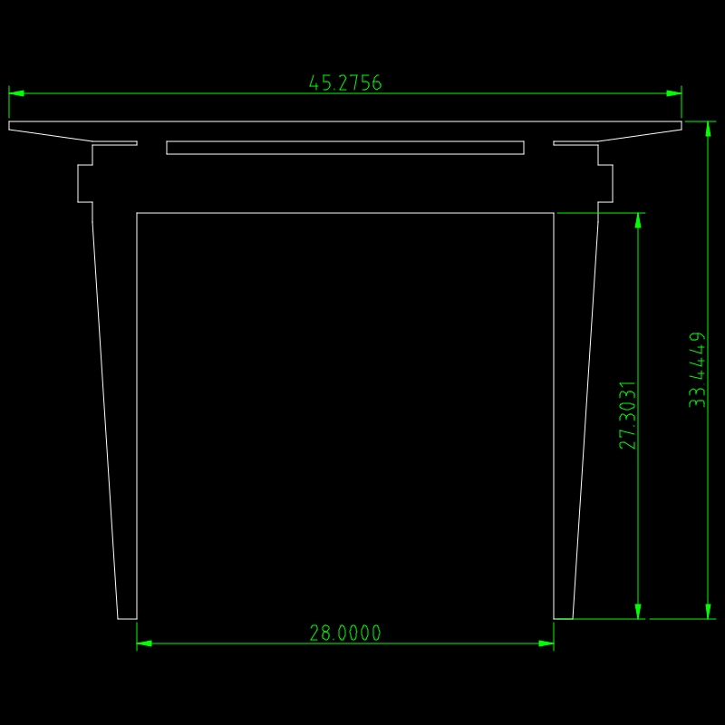
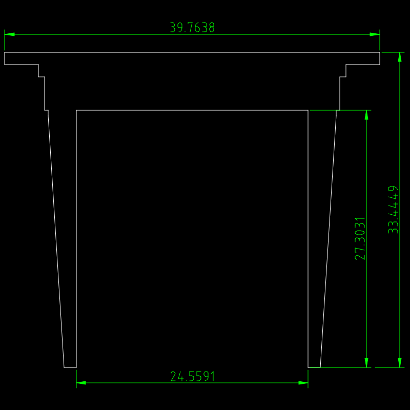

# Table Prototype

DXF drawing files for the [Table prototype project](https://github.com/jonlamb-gh/openscad-models-rust/tree/master/wood-projects/table)

## Front

Units = centimeter

Units = inch

## Left

Units = centimeter

Units = inch

## Top

## Leg, Joinery Type 0

Q0/Q2

