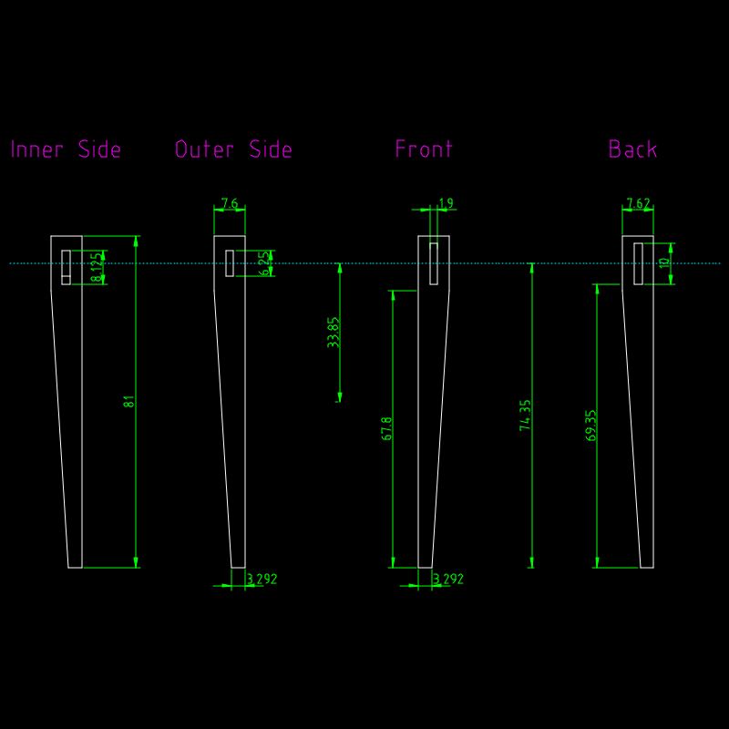

# Table Prototype

DXF drawing files for the [Table prototype project](https://github.com/jonlamb-gh/openscad-models-rust/tree/master/wood-projects/table)

A photo album of the entire project is hosted [here](https://jonlamb-gh.github.io/wood-projects/table/site/index.html)

Units = centimeter

## Front

## Left

## Top

## Bottom

## Top Supports

## Leg, Joinery Type 0

Q0/Q2

## Leg, Joinery Type 1

Q1/Q3

## Major Top Board

